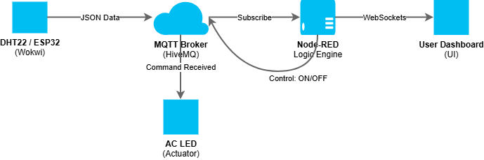

# 🏠 Smart Room IoT Digital Twin

A real-time **IoT Digital Twin** implementation for a smart room, combining virtual hardware, cloud messaging, and a live dashboard.  
The system mirrors a physical environment, processes telemetry in the cloud, and enables both **automatic** and **manual control**.

---

## 🚀 Project Overview

This project demonstrates a synchronized **Digital Twin** using a four-layer IoT architecture.  
Environmental data is collected from a virtual **ESP32**, transmitted via **MQTT**, processed in **Node-RED**, and visualized in a **real-time dashboard**.

---

## 🧱 System Architecture

The system follows the industry-standard **four-layer IoT model**:

### 1. Physical Layer (Wokwi Simulation)

The *physical* asset consists of:
- ESP32 microcontroller  
- DHT22 temperature and humidity sensor  
- Blue LED representing the Air Conditioning unit  

📸 **Figure 1 – Wokwi Simulation**  
*Live telemetry publishing and Cloud Command reception.*

---

### 2. Communication Layer (MQTT)

Telemetry data is broadcast as **JSON payloads** to the public MQTT broker:

📸 **Figure 2 – MQTT WebSocket Monitoring**  
*Real-time JSON packets received from the virtual room.*

---

### 3. Digital Twin Layer (Node-RED)

This layer represents the **brain** of the system, where raw sensor data is transformed into insights such as **Comfort Level** and actuator decisions.

📸 **Figure 3 – Node-RED Digital Twin Logic**  
*Synchronization, threshold evaluation, and control flow.*

---

### 4. Application Layer (Dashboard UI)

A human-centric interface that provides:
- Live room conditions  
- Comfort status indicators  
- Historical trend visualization  

📸 **Figure 4 – Digital Twin Dashboard**  
*STUFFY comfort status at 28.8 °C.*

---

## 🔄 Data Flow & Synchronization

📸 **Figure 5 – End-to-End Data Flow**  
*Sensor → MQTT → Node-RED → Dashboard → Actuator*

---

## 🔌 Hardware Wiring (Virtual)

| Component        | ESP32 Pin | Connection Type |
|------------------|-----------|-----------------|
| DHT22 (SDA)      | GPIO 15   | Data Input      |
| AC LED (Anode)   | GPIO 2    | Actuator Output |
| VCC / GND        | 3.3V / GND| Power Rail      |
